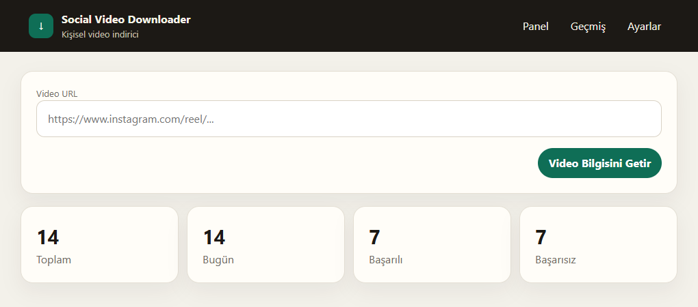
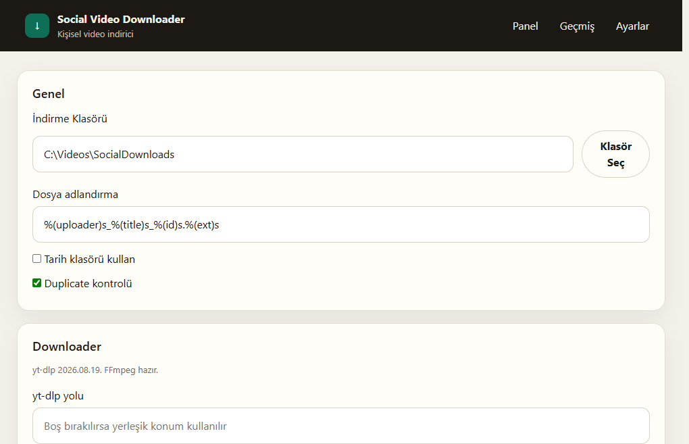
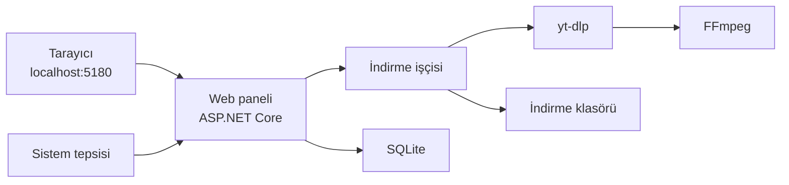

<p align="center">
  
</p>

<h1 align="center">Social Video Downloader</h1>

<p align="center">
  Instagram, TikTok ve X için kişisel video indirici.<br>
  Web paneli, sistem tepsisi ve Windows hizmeti aynı bilgisayarda çalışır.
</p>

<p align="center">
  
  
  
  
</p>

<p align="center">
  <a href="#hızlı-başlangıç">Başlat</a> ·
  <a href="#ekranlar">Ekranlar</a> ·
  <a href="#özellikler">Özellikler</a> ·
  <a href="#mimari">Mimari</a>
</p>

Adresi yapıştırın, video bilgisini alın, indirin. Dosyalar platform klasörlerine yazılır. İlerleme, geçmiş ve tekrar deneme panelden izlenir. Ağ kapısı varsayılan olarak yalnızca bu bilgisayara açıktır.

## Hızlı başlangıç

Windows ve [.NET 10 SDK](https://dotnet.microsoft.com/download) gerekir.

Proje klasöründe `Baslat.cmd` dosyasına çift tıklayın. Web paneli ve tepsi uygulaması birlikte açılır.

Git Bash kullanıyorsanız:

```bash
./baslat.sh
```

Tarayıcı adresi:

```text
http://localhost:5180
```

İlk açılışta **Ayarlar → Downloader** bölümünden yt-dlp ve FFmpeg kurulumunu yapın. Kurulum bitince ana sayfadan bir video adresi yapıştırabilirsiniz.

Elle başlatmak için:

```powershell
dotnet run --project SocialVideoDownloader.Web
dotnet run --project SocialVideoDownloader.Tray
```

## Ekranlar

<p align="center">
  
</p>

<p align="center"><sub>Panel: adres, bilgi getir, günlük sayaçlar.</sub></p>

<p align="center">
  
</p>

<p align="center"><sub>Ayarlar: klasör, dosya adı, yinelenen kayıt kontrolü ve araçlar.</sub></p>

## Özellikler

| | |
| --- | --- |
| **Platformlar** | Instagram, TikTok, X / Twitter. Tanınmayan adresler ayrı klasöre alınır. |
| **İndirme** | Bilgi önizlemesi, ilerleme, geçmiş, iptal, tekrar ve dosyayı klasörde açma. |
| **Dosyalar** | Platform klasörü, isteğe bağlı tarih klasörü, yt-dlp dosya adı şablonu. |
| **Araçlar** | yt-dlp ve FFmpeg panelden kurulur. Ses ve görüntü birleştirme FFmpeg ile yapılır. |
| **Tepsi** | Panel, indirme klasörü ve servis kısayolları saat yanında durur. |
| **Açılış** | `Baslat.cmd` web ve tepsiyi birlikte açar. Windows ile başlat oturum açılınca çalışır. |
| **Hizmet** | Web ve indirme işçisi Windows hizmeti olarak arka planda kalabilir. |
| **Adres** | Varsayılan `127.0.0.1:5180`. Bu bilgisayarın kendi IP’si de bağlanabilir. Başka cihazlara açılmaz. |

İndirilen videolar varsayılan olarak `Videos\SocialDownloads` altındaki `Instagram`, `TikTok` ve `Twitter` klasörlerine gider.

## Mimari



| Proje | Görevi |
| --- | --- |
| `SocialVideoDownloader.Web` | Panel, API ve Kestrel sunucusu |
| `SocialVideoDownloader.Core` | İş kuralları, modeller, adres çözümleme |
| `SocialVideoDownloader.Infrastructure` | SQLite, yt-dlp, indirme işçisi |
| `SocialVideoDownloader.Tray` | Saat yanı uygulaması |
| `SocialVideoDownloader.Tests` | Güvenlik ve indirme akışı testleri |

Veritabanı ve günlükler `C:\ProgramData\SocialVideoDownloader` altındadır. Araçlar aynı kökteki `Tools` klasörüne kurulur.

## Bilgisayar açılınca

**Ayarlar** sayfasında **Windows ile başlat** kutusunu işaretleyip kaydedin. Oturum açılınca `Baslat.cmd` çalışır.

Hizmet olarak kurmak için yönetici PowerShell:

```powershell
powershell -ExecutionPolicy Bypass -File .\scripts\publish.ps1
powershell -ExecutionPolicy Bypass -File .\dist\service\install-service.ps1
```

Hizmet adı `SocialVideoDownloader` olur ve otomatik başlar. Kaldırmak için `dist\service\uninstall-service.ps1` dosyasını yönetici olarak çalıştırın.

IP veya port değişince programı yeniden başlatın. Değişiklik çalışan sürece hemen uygulanmaz.

## Sınırlar

Bu uygulama, indirme hakkınız olan veya indirilmesine izin verilen içerikler içindir.

- Parola, çerez ve hesap bilgisi saklanmaz.
- DRM, erişim kontrolü ve platform korumaları aşılmaz.
- Panel varsayılan olarak yalnızca bu bilgisayardan açılır. Yerel IP yazılsa bile başka telefon veya bilgisayarlar giremez.

## Geliştirme

```powershell
dotnet test
dotnet build
```

Kod değiştikten sonra çalışan pencereyi durdurup yeniden başlatın. Hizmet kuruluysa hizmeti yeniden başlatın.
